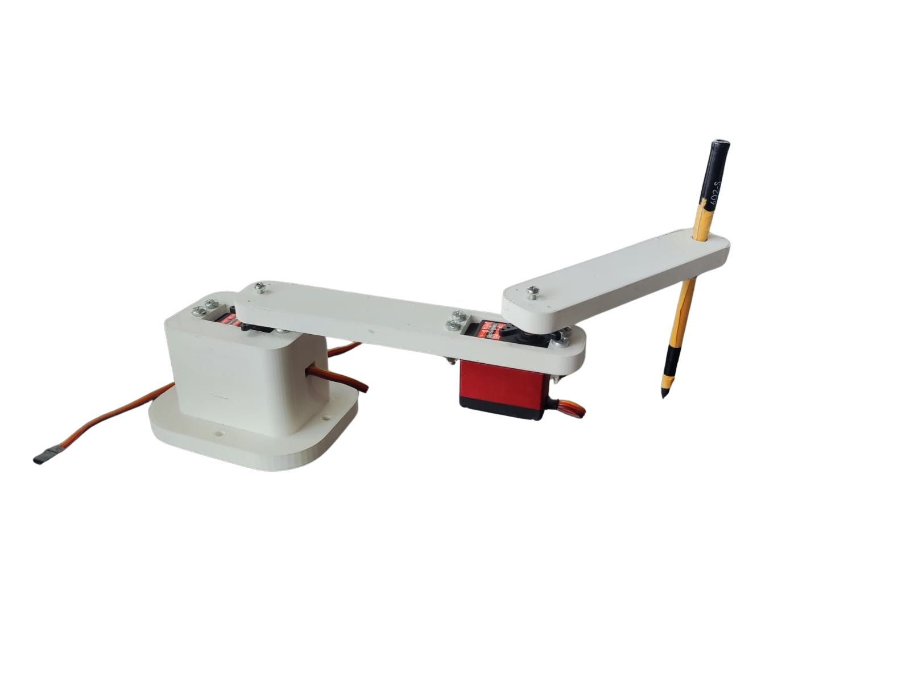
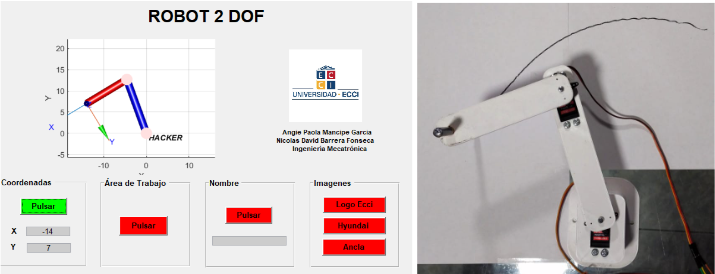
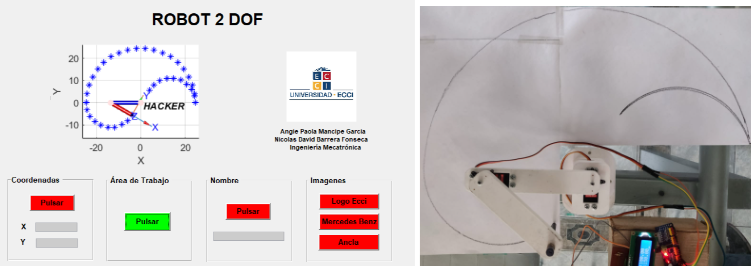
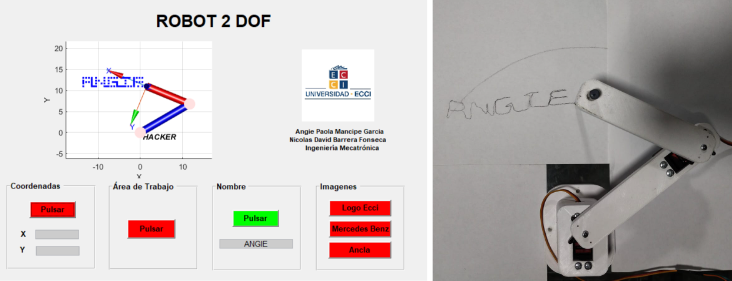
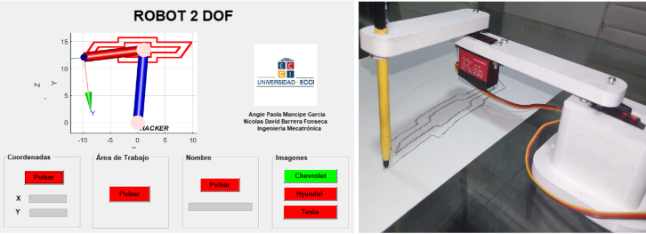
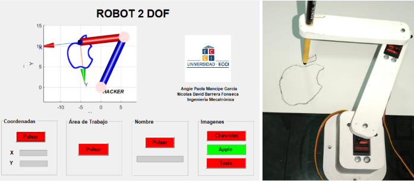
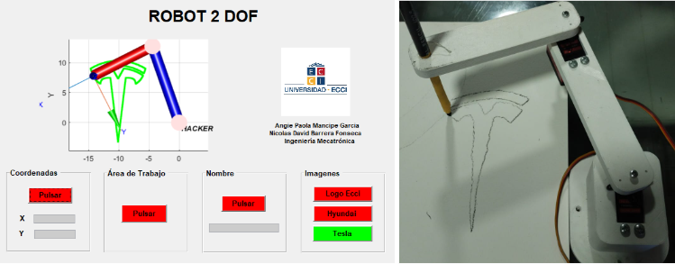

<h1 align="center">BRAZO ROBÓTICO DE 2GDL PROGRAMADADO CON MATLAB Y EL MICROCONTROLADOR PIC18F46K22🤖🦾  
Version 2.0 ✨ 
Nicolas Barrera y Angie Mancipe 
Universidad Ecci 🏫</h1> 

## Descripción 📝

Desarrollo de un brazo robótico de 2 grados de libertad (GDL) programado mediante la integración de MATLAB y el microcontrolador PIC18F46K22. Capaz de realizar seguimiento de coordenadas, delimitación del espacio de trabajo y escritura de caracteres alfabéticos. Su función principal incluye el procesamiento de imágenes para el reconocimiento y trazo de contornos en imágenes preestablecidas.

## Materiales 🛠️
1. Computador con Windows 10 o superior y un mínimo de 4 GB de memoria RAM
2. Microcontrolador PIC18F46K22
3. Controlador de servomotores PCA9685
4. Dos servomotores TD8120MG de 20Kg
5. Pantalla LCD 16x2
6. Un TTL (Transistor-Transistor Logic)
7. PLA (Ácido Poliláctico) para Impresión 3D

## Software y Librerías 💻
### Software Utilizado
- **MATLAB**: Lenguaje de programación para controlar el brazo robótico de 2GDL.
- **MPLAB X**: Entorno de desarrollo integrado (IDE) de Microchip Technology utilizado para programar y controlar los servomotores mediante el microcontrolador PIC.
- **XC8**: Compilador desarrollado por Microchip específicamente para los microcontroladores de 8 bits, como los de las familias PIC.
- **Proteus**: Utilizado principalmente para el diseño, simulación y prueba de circuitos electrónicos.
- **Windows 10**: Sistema operativo utilizado para el desarrollo del software y la ejecución de simulaciones.

### Librerías
- **GUIDE**: Herramienta para la creación de interfaces gráficas de usuario (GUI) en MATLAB, utilizada para desarrollar una interfaz interactiva para el control del brazo robótico.
- **Toolbox de Robótica de Peter Corke**: Conjunto de herramientas para MATLAB diseñado para la simulación, análisis y control de sistemas robóticos, que incluye funciones de cinemática, dinámica y control de robots.

## PDF 📚
- **Datasheet PIC18F46K22**: [Descargar](PDFs/PIC18F46K22.pdf)
- **Datasheet PCA9685**: [Descargar](PDFs/datasheet_PCA9685.pdf)

## Planos CAD SolidWorks 📐
- **Base:** [Descargar](planos/Base.SLDPRT)
- **Eslabon 1:** [Descargar](planos/Eslabon1.SLDPRT)
- **Eslabon 2:** [Descargar](planos/Eslabon2.SLDPRT)

## Artículo 📑
**Desarrollo de un brazo robótico de 2 DOF impreso en 3D a través de un PIC18f46k22 y MATLAB para el trazo de contornos de imágenes**  
**Angie M., Nicolás B., Diego R., Fabián B.**  
Popayán, Colombia: Universidad Unicomfacauca.  

DOI: [https://doi.org/10.57173/ritc.v1n17a12](https://doi.org/10.57173/ritc.v1n17a12)

## Resultados ☑️
### Robot 2R:

    

### Seguimiento a Coordenadas:

    

### Espacio de Trabajo:

    

### Escritura de caracteres:

    

### Trazo imagen sección horizontal:

    

### Trazo imagen sección cuadrada:

    

### Trazo imagen sección vertical:

    

