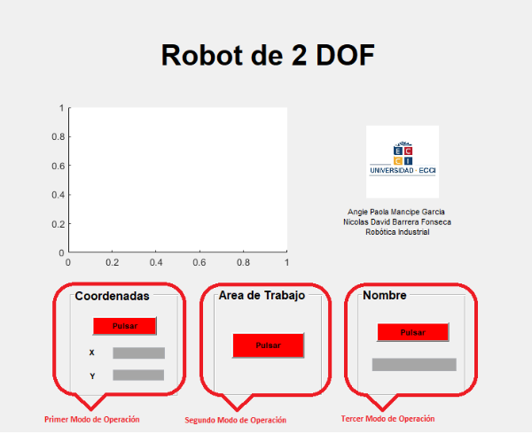
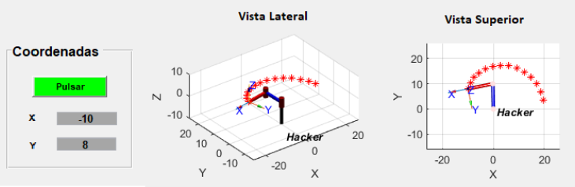
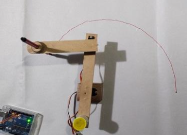
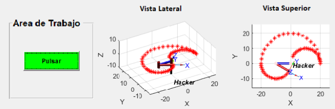
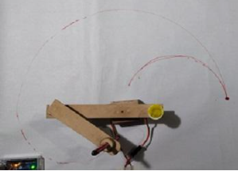
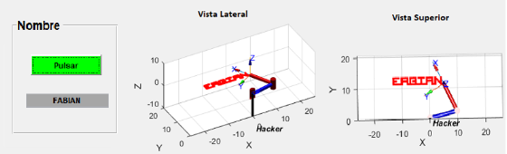

<h1 align="center">ROBOT DE 2GDL PROGRAMADADO CON MATLAB Y MICROCONTROLADOR DE BAJO COSTO ARDUINO UNO🤖🦾  
Version 1.0 ✨ 
Nicolas Barrera y Angie Mancipe 
Universidad Ecci 🏫</h1> 

## Descripción 📝

Prototipo de bajo costo de un brazo robótico de 2 grados de libertad (2GDL). Este prototipo está programado con un microcontrolador de bajo costo (Arduino Uno) y utiliza servomotores para el movimiento de las articulaciones del robot. El sistema incluye características como seguimiento de coordenadas, definición del espacio de trabajo del robot y la capacidad de escribir caracteres alfabéticos.

## Materiales 🛠️
1. Computador con Windows 10 o superior y un mínimo de 4 GB de memoria RAM
2. Arduino Uno
3. Dos servomotores MG90
4. Madera MDF 

## Software y Librerías 💻
### Software Utilizado
- **MATLAB**: Lenguaje de programación para controlar el brazo robótico de 2GDL.
- **Arduino Support Package**: Paquete que permite controlar y adquirir datos desde placas Arduino directamente en MATLAB.
- **Windows 10**: Sistema operativo.

### Librerías
- **GUIDE**: Herramienta para la creación de interfaces gráficas de usuario en MATLAB.
- **Toolbox de Robótica de Peter Corke**: Conjunto de herramientas diseñado para la simulación y el control del robot.

## Artículo 📑
**Robot de 2 DOF programado con MatLab (Guide y Peter Corke) y Arduino Uno para escritura de caracteres alfabéticos**  
**Angie M., Nicolás B., Diego R., Fabián B.**  
**XVII Congreso Internacional de Electrónica, Control y Telecomunicaciones** (pp. 793-814).  
Bogotá, Colombia: Universidad Distrital.  

Puedes leer el artículo [aquí](https://www.dropbox.com/scl/fi/kknik09re9m158va2obvi/MEMORIAS_CIECT_XVII_FINAL.pdf?rlkey=nhics03zhbl1l7xiqecyt4csl&e=2&dl=0).

## Resultados ☑️
### Interfaz Gráfica:

    

### Primer Modo:

    

    

### Segundo Modo:

    

    

### Tercer Modo:

    

    

